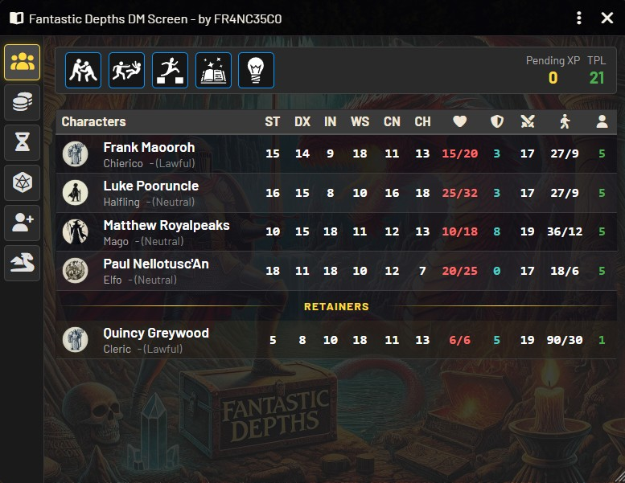
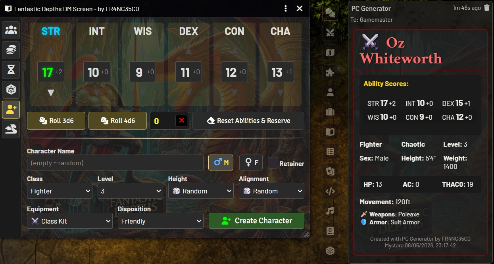
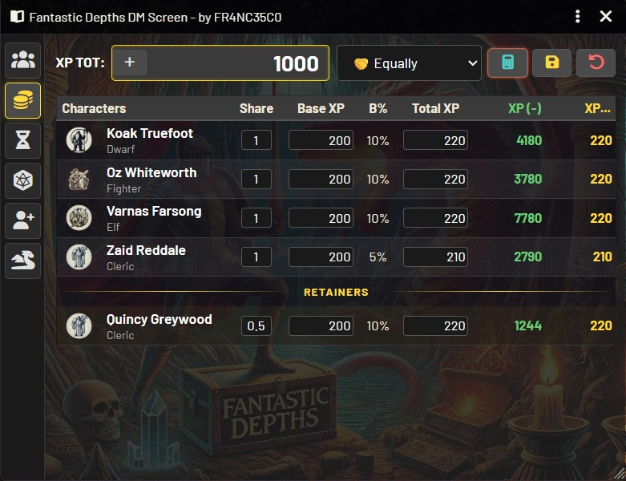
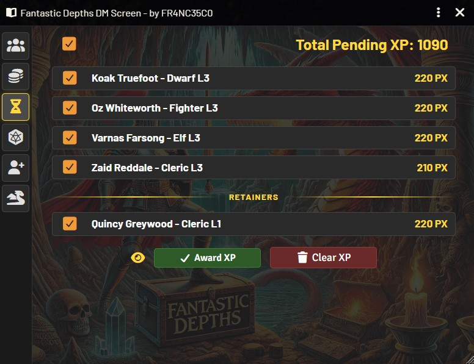
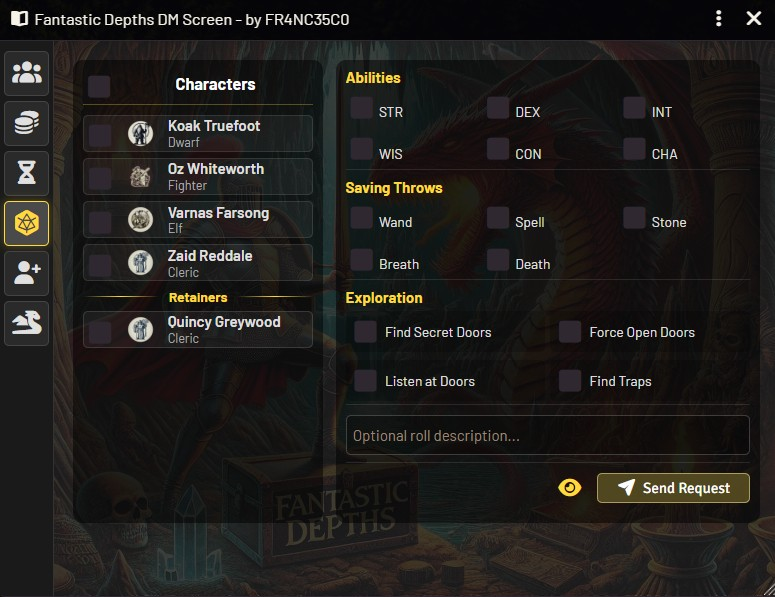

# Fantastic Depths DM Screen


[English](#english) | [Italiano](#italiano)

     

<a name="english"></a>
## English

Foundry VTT module for Party management, Experience Points (XP) distribution, Encounter and character generation for the **Fantastic Depths** system with BECMI and Rules Cyclopedia rules.

### Compatibility
- **Foundry VTT**: v13 and v14
- **System Requirements**: Fantastic Depths v1.0.13
- **Modules Requirements**: Fantastic Depths Compendiums v1.0.3
- **Module Version**: 1.0.0

### Installation
#### Method 1: Manifest URL (Recommended)

1. Open Foundry VTT and go to **Add-on Modules**
2. Click **Install Module**
3. Enter this URL in the **Manifest URL** field:
   ```
   https://github.com/FR4NC35CO/fantastic-depths-dm-screen/releases/download/latest/module.json
   ```
4. Click **Install**

#### Method 2: Manual

1. Download the `.zip` file from the [Releases](https://github.com/FR4NC35CO/fantastic-depths-dm-screen/releases) section
2. Extract to the `Data/modules/` folder of Foundry VTT
3. Rename the folder to `fantastic-depths-dm-screen`
4. Restart Foundry VTT

### Features
#### 🎭 Party Tab
- Complete party view with statistics ready for roll checks
- Party Total Level (LTP)
- TotalPending XP
- Quick links to character sheets

#### 💰 Award XP Tab
- XP auto-import from ended combat encounters
- Equal XP division among all characters
- Share quota division
- Custom mode
- Store XP as pending to assign in full rest conditions

#### ⏳ Pending XP Tab
- View accumulated XP
- Select characters for awarding
- Clear pending XP

#### ⚔️ Character Generator Tab
- Quick character/retainer generation
- Automatic abilities rolling (3d6 or 4d6 drop lowest)
- Support for all Fantastic Depths classes and items
- Random or manual character features selection
- Option to generate hostile or neutral characters
- Equipment generation modes (standard, random, manual)

#### 🐉 Encounter Generator Tab
- Generate random encounters based on party level (TPL)
- Multiple challenge levels (Too Easy, Minor, Good Fight, Major, Intense, Lethal)
- Filter by monster type, location, and rarity
- Monster pool includes both the compendium and any Monsters/NPCs created in the world (excluding Party and Retainers folders)
- Real-time TPL (Total Party Level) tracking based on current HP
- "Drop to Scene" functionality - place generated monsters directly on the map

#### ⚔️ Combat Integration
- Automatic XP tracking from defeated NPCs
- Treasure table processing at combat end
- GM-only chat messages for roll table execution
- Clickable links in chat to execute roll tables

### Usage
After installation, you'll find the **"DM Screen"** button in the Actors sidebar and a book button just above the hot bar. Click to open the DM Screen.

#### First Launch

On first launch, the module will automatically create the necessary folders:
- **Party** - for player characters
- **Retainers** - for followers

#### Character Generation

1. Go to the **Generate Character** tab
2. Select a class (required)
3. Enter stats manually or click **Roll Stats**
4. Click **Generate Character**
5. The character will be created in the Party folder

#### XP Management

1. Go to the **Award XP** tab
2. Enter the total XP to distribute
3. Select the division mode
4. Click **Calculate**
5. Click **Store XP** to save as pending, or **Award XP** to award immediately

#### Encounter Generation

1. Go to the **Generate Encounter** tab
2. Select challenge level, mode (Random Table or By Type), location, and other options
3. Click **Generate Encounter**
4. Review the generated encounter showing monster quantities and adjusted HD
5. Click **Drop to Scene** to place tokens on the map (GM only)
6. Click on the map to position the monsters in a circular formation

### Requirements
- **Fantastic Depths v1.0.13** system installed and active
- **Fantastic Depths Compendiums v1.0.3** system installed and active
- **Game Master** role to use all features

### Support
For bugs, suggestions, or support:
- Open an issue on [GitHub](https://github.com/FR4NC35CO/fantastic-depths-dm-screen/issues)
- Discord: FR4NC35C0

### Credits
- **Author**: FR4NC35C0
- **System**: Fantastic Depths by Forelius
- **License**: MIT

### Changelog
#### v1.0.0
- Initial release
- Party and XP management
- Integrated character generator
- Foundry V13/V14 compatibility

---

<a name="italiano"></a>
## Italiano

Modulo Foundry VTT per la gestione del Party, distribuzione di Punti Esperienza (PX), generazione di incontri e personaggi per il sistema **Fantastic Depths** con regole BECMI e Rules Cyclopedia.

### Compatibilità
- **Foundry VTT**: v13 e v14
- **System Requirements**: Fantastic Depths v1.0.13
- **Modules Requirements**: Fantastic Depths Compendiums v1.0.3
- **Versione modulo**: 1.0.0

### Installazione
#### Metodo 1: Manifest URL (Consigliato)

1. Apri Foundry VTT e vai nella sezione **Add-on Modules**
2. Clicca **Install Module**
3. Inserisci questo URL nel campo **Manifest URL**:
   ```
   https://github.com/FR4NC35CO/fantastic-depths-dm-screen/releases/download/latest/module.json
   ```
4. Clicca **Install**

#### Metodo 2: Manuale

1. Scarica il file `.zip` dalla sezione [Releases](https://github.com/FR4NC35CO/fantastic-depths-dm-screen/releases)
2. Estrai nella cartella `Data/modules/` di Foundry VTT
3. Rinomina la cartella in `fantastic-depths-dm-screen`
4. Riavvia Foundry VTT

### Caratteristiche
#### 🎭 Tab Party
- Visualizzazione completa del party con statistiche pronte per i tiri di prova
- Livello Totale del Party (LTP)
- PX Totali in Attesa
- Collegamento rapido alle schede personaggio

#### 💰 Tab Assegna PX
- Importazione automatica PX da combattimenti terminati
- Divisione equa dei PX tra tutti i personaggi
- Divisione per quota
- Modalità personalizzata
- Memorizzazione PX in attesa da assegnare in condizioni di riposo completo

#### ⏳ Tab PX in Attesa
- Visualizzazione dei PX accumulati
- Selezione personaggi per assegnazione
- Azzeramento PX in attesa

#### ⚔️ Tab Genera PG
- Generazione rapida di personaggi e seguaci
- Tiro caratteristiche automatico (3d6 o 4d6 scarta il più basso)
- Supporto per tutte le classi e oggetti di Fantastic Depths
- Selezione casuale o manuale delle caratteristiche del personaggio
- Opzione per generare personaggi ostili o neutrali
- Modalità di generazione equipaggiamento (standard, casuale, manuale)

#### ⚔️ Integrazione Combattimento
- Tracciamento automatico PX dai PNG sconfitti
- Elaborazione tabelle tesoro alla fine del combattimento
- Messaggi chat GM-only per esecuzione tabelle
- Link cliccabili in chat per eseguire tabelle
- Traduzione nomi tabelle (Inglese ↔ Italiano)

#### 🐉 Tab Genera Incontro
- Generazione incontri casuali basati sul livello del party (LTP)
- Multipli livelli di sfida (da Troppo Facile a Estremamente Pericolosa)
- Filtraggio per tipo di mostro, luogo e rarità
- LTP Dinamico (Livello Totale Party) in tempo reale basato sui PF attuali dei PG
- Funzione "Inserisci nella Scena" - posiziona i mostri generati direttamente sulla mappa

### Utilizzo
Dopo l'installazione, troverai il pulsante **"DM Screen"** nella sidebar degli Attori e un pulsante a forma di libro sopra la hot bar. Clicca per aprire il DM Screen.

#### Primo avvio

Al primo avvio, il modulo creerà automaticamente le cartelle necessarie:
- **Party** - per i personaggi giocatore
- **Seguaci** - per i seguaci

#### Gestione PX

1. Vai nel tab **Assegna PX**
2. Inserisci il totale PX da dividere
3. Seleziona la modalità di divisione
4. Clicca **Calcola**
5. Clicca **Memorizza PX** per salvare in attesa, o **Assegna PX** per assegnare immediatamente

#### Generazione Personaggi

1. Vai nel tab **Genera PG**
2. Seleziona una classe (obbligatorio)
3. Inserisci le caratteristiche manualmente o clicca **Tira Caratteristiche**
4. Clicca **Genera Personaggio**
5. Il personaggio verrà creato nella cartella Party

#### Generazione Incontro

1. Vai nel tab **Genera Incontro**
2. Seleziona livello sfida, modalità (Tabella Casuale o Per Tipo), località e altre opzioni
3. Clicca **Genera Incontro**
4. Revisiona l'incontro generato che mostra le quantità di mostri e i DV modificati
5. Clicca **Inserisci nella Scena** per posizionare i token sulla mappa (solo GM)
6. Clicca sulla mappa per posizionare i mostri in formazione circolare

### Requisiti
- Sistema **Fantastic Depths v1.0.13** installato e attivo
- Sistema **Fantastic Depths Compendiums v1.0.3** installato e attivo
- Ruolo **Game Master** per utilizzare tutte le funzionalità

### Supporto
Per bug, suggerimenti o supporto:
- Apri una issue su [GitHub](https://github.com/FR4NC35CO/fantastic-depths-dm-screen/issues)
- Discord: FR4NC35C0

### Crediti
- **Autore**: FR4NC35C0
- **Sistema**: Fantastic Depths by Forelius
- **Licenza**: MIT

### Changelog
#### v1.0.0
- Rilascio iniziale
- Gestione Party e PX
- Generatore personaggi e incontri integrato
- Compatibilità Foundry V13/V14

---

### AI Disclosure

This module was developed with AI coding assistance.
All code has been reviewed, understood, tested, and is fully maintained by the author.
This project complies with the [Foundry VTT AI Content Policy](https://foundryvtt.com/article/ai-policy/).
